<h2 align="left">Hey 👋, I'm Yuvraj Kumar — I build, break & improve things.</h2>

### 

###

  
  

###

  
  

  
  

  
  

  
  

  
  

  
  

  
  

  
  

 

  
  

  

###

<h3 align="left">💻 Java Full Stack Developer</h3>

  Java • Spring Boot • Hibernate/JPA • MySQL • JavaScript • React • REST APIs • JWT • Spring Security

###

  

  

  

###

<h3 align="left">🚆 Featured Project — Rail Bharat</h3>

  Full-stack railway reservation platform built with Java 21, Spring Boot, Hibernate/JPA, MySQL and JavaScript.
  Features include train search, JWT authentication, booking, cancellation, PNR lookup, Razorpay Test Mode and email notifications.

  🌐 <a href="https://rail-bharat.vercel.app">Live Demo</a> &nbsp; • &nbsp;
  💻 <a href="https://github.com/YuvrajKumar69/Rail-Bharat">Source Code</a>

###

 

  

###

### 🚀 Keep Building • Keep Learning • Keep Growing

